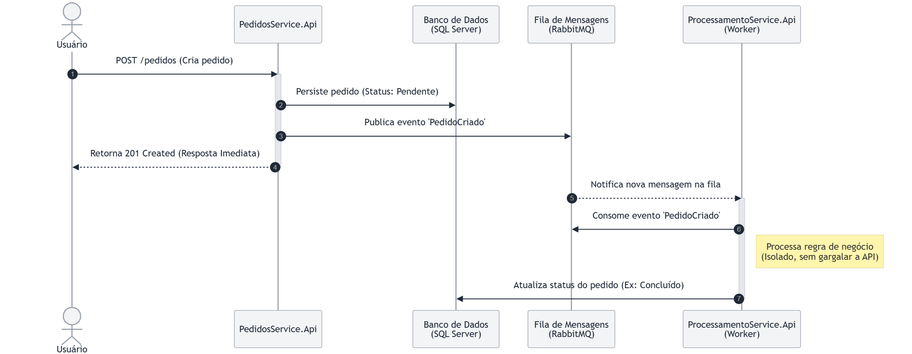

# Sistema de Integração de Pedidos

Arquitetura de microsserviços com **.NET 8** utilizando Arquitetura Orientada a Eventos (Event-Driven), mensageria com **RabbitMQ** e processamento assíncrono com Background Worker.

Este projeto demonstra uma **arquitetura de microsserviços utilizando ASP.NET Core**, simulando um fluxo real de sistemas distribuídos onde uma API recebe pedidos e delega o processamento de forma assíncrona, garantindo alta disponibilidade e tolerância a falhas.

O objetivo é demonstrar **boas práticas utilizadas no desenvolvimento backend moderno**, incluindo mensageria, observabilidade, tratamento de erros e containerização da aplicação.

---

# Arquitetura do Projeto

O sistema é composto por dois serviços principais totalmente desacoplados:

## API de Pedidos (Producer)
Responsável por:
* Receber novos pedidos via HTTP (REST).
* Persistir os pedidos no banco de dados.
* **Publicar eventos** de `PedidoCriado` na fila do RabbitMQ.
* Registrar logs estruturados das operações.

## API de Processamento (Consumer / Worker)
Responsável por:
* **Consumir mensagens** da fila do RabbitMQ instantaneamente.
* Processar a regra de negócio do pedido em segundo plano (BackgroundService).
* Atualizar o status do pedido no banco com segurança.



---

# Tecnologias Utilizadas

* ASP.NET Core (.NET 8)
* Entity Framework Core & SQL Server
* **Mensageria com RabbitMQ (Message Broker)**
* BackgroundService (Worker Service) para consumo de filas
* Arquitetura Orientada a Eventos (Event-Driven)
* Logging estruturado & Middleware global de exceções
* Docker e Docker Compose

---

# Fluxo do Sistema

1. Um pedido é criado na **API de Pedidos** via requisição HTTP.
2. O pedido é persistido no banco de dados (SQL Server).
3. A API publica um evento `PedidoCriado` de forma assíncrona em uma fila do **RabbitMQ**.
4. O usuário recebe a resposta imediata de sucesso (`201 Created`).
5. A **API de Processamento** (atuando como um Worker Service em background) escuta a fila do RabbitMQ.
6. O Worker consome a mensagem instantaneamente, processa a regra de negócio e atualiza o status de forma isolada, garantindo resiliência e evitando gargalos na rede.

---

# Recursos Implementados

## Mensageria e Processamento Assíncrono (RabbitMQ)
O sistema abandonou o acoplamento síncrono (HTTP direto) e utiliza o **RabbitMQ** para garantir uma arquitetura resiliente:
* **Desacoplamento:** A API principal apenas publica o evento e libera o usuário instantaneamente, sem travar aguardando o processamento.
* **Confirmação de Entrega (Ack/Nack):** Implementação de controle manual de *Acknowledge*. A mensagem só é removida da fila se o processamento for 100% concluído com sucesso. Em caso de erro, ela é devolvida para a fila para retentativa.

## Logging Estruturado
O projeto utiliza o sistema de logging nativo do ASP.NET Core para registrar eventos importantes da aplicação (criação, falhas, processamento de filas), facilitando o monitoramento e rastreabilidade.

## Middleware Global de Exceções
Foi implementado um middleware personalizado para capturar erros inesperados, retornar respostas padronizadas e evitar a exposição de dados sensíveis da infraestrutura interna.

---

# Containerização da Aplicação

A aplicação foi desenhada para ser executada utilizando **containers Docker**, permitindo subir toda a infraestrutura com apenas um comando (`docker-compose up`).

O ambiente inclui a orquestração simultânea de:
* API de Pedidos
* API de Processamento
* Banco de dados SQL Server
* **Servidor RabbitMQ (com Management UI)**

---

# Estrutura do Projeto

IntegracaoPedidos
│
├── PedidosService.Api
│   ├── Controllers
│   ├── DTOs
│   ├── Mensageria
│   ├── Middleware
│   ├── Models
│   ├── Services
│
├── ProcessamentoService.Api
│   ├── Services
│   ├── Workers
│
├── IntegracaoPedidos.Core
│   ├── Enums
│   ├── Interfaces
│   ├── Models
│
├── IntegracaoPedidos.Infrastructure
│   ├── Data
│   ├── Migrations
│   ├── Repositories
│
└── docker-compose.yml

---

# Como Executar o Projeto

## 1 - Clonar o repositório
```bash
git clone [https://github.com/dourado86/sistema-integracao-pedidos.git](https://github.com/dourado86/sistema-integracao-pedidos.git)