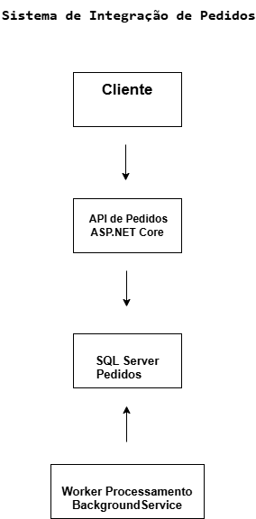

# Sistema de Integração de Pedidos

Arquitetura de microsserviços com **.NET 8** utilizando comunicação HTTP entre serviços e processamento assíncrono com Background Worker.

Este projeto demonstra uma **arquitetura de microsserviços utilizando ASP.NET Core**, simulando um fluxo real de sistemas distribuídos onde uma API recebe pedidos e outra API realiza o processamento desses pedidos automaticamente.

O objetivo é demonstrar **boas práticas utilizadas no desenvolvimento backend moderno**, incluindo observabilidade, tratamento de erros e containerização da aplicação.

---

# Arquitetura do Projeto

O sistema é composto por dois serviços principais:

## API de Pedidos

Responsável por:

* Receber novos pedidos via HTTP
* Persistir os pedidos no banco de dados
* Disponibilizar pedidos para processamento
* Registrar logs das operações da API

## API de Processamento

Responsável por:

* Buscar pedidos pendentes
* Processar pedidos automaticamente
* Atualizar o status do pedido

O processamento é feito utilizando **BackgroundService**, simulando um worker que executa tarefas em segundo plano.



---

# Tecnologias Utilizadas

* ASP.NET Core (.NET 8)
* Entity Framework Core
* SQL Server
* BackgroundService (Worker Service)
* REST API
* Arquitetura em camadas
* Logging estruturado
* Middleware global de exceções
* Docker e Docker Compose

---

# Fluxo do Sistema

1. Um pedido é criado na **API de Pedidos**
2. O pedido é salvo no banco com status **Pendente**
3. A **API de Processamento** executa um worker em segundo plano
4. Em intervalos regulares o worker busca novos pedidos
5. O pedido é processado automaticamente
6. O status do pedido é atualizado para **Processado**

---

# Recursos Implementados

## Logging Estruturado

O projeto utiliza o sistema de logging nativo do ASP.NET Core para registrar eventos importantes da aplicação, como:

* criação de pedidos
* processamento de pedidos
* falhas de execução

Isso facilita **monitoramento e rastreabilidade do sistema**.

---

## Middleware Global de Exceções

Foi implementado um **middleware personalizado de tratamento de exceções**, responsável por:

* capturar erros inesperados
* retornar respostas padronizadas da API
* evitar exposição de erros internos da aplicação

Exemplo de resposta:

```json
{
  "error": "Erro interno",
  "message": "Ocorreu um erro inesperado"
}
```

---

# Containerização da Aplicação

A aplicação pode ser executada utilizando **containers Docker**, permitindo subir toda a infraestrutura do sistema com apenas um comando.

O ambiente inclui:

* API de Pedidos
* API de Processamento
* Banco de dados SQL Server

Executando com Docker Compose.

---

# Estrutura do Projeto

IntegracaoPedidos

│
├── PedidosService.Api
│   ├── Controllers
│   ├── DTOs
│   ├── Services
│   ├── Middleware
│
├── ProcessamentoService.Api
│   ├── Services
│   ├── Workers
│
├── IntegracaoPedidos.Core
│
├── IntegracaoPedidos.Infrastructure
│
└── docker-compose.yml

---

# Como Executar o Projeto

## 1 - Clonar o repositório

```bash
git clone https://github.com/dourado86/sistema-integracao-pedidos.git
```

---

## 2 - Executar utilizando Docker

Certifique-se de ter o Docker instalado.

Execute:

```bash
docker compose up
```

Isso irá iniciar:

* SQL Server
* API de Pedidos
* API de Processamento

---

## 3 - Acessar o Swagger

API de Pedidos:

```
http://localhost:5001/swagger
```

API de Processamento:

```
http://localhost:5002/swagger
```

---

# Próximos Passos do Projeto

Este projeto continuará evoluindo para demonstrar **diferentes padrões de integração entre microsserviços**.

Versão atual:

Comunicação entre APIs utilizando **HTTP**

Próxima versão:

Comunicação utilizando **mensageria com RabbitMQ**

Objetivo:

Demonstrar **arquitetura orientada a eventos em sistemas distribuídos**.

---

# Autor

Desenvolvido por

**Rafael Dourado**
